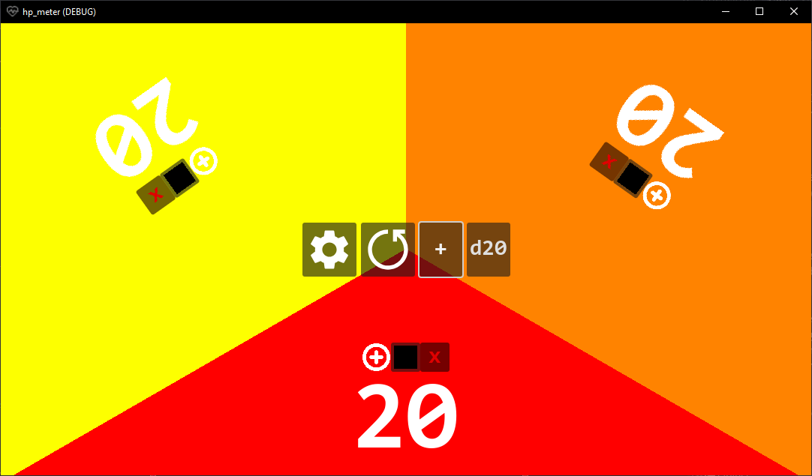
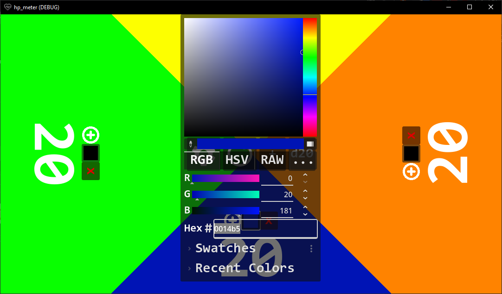
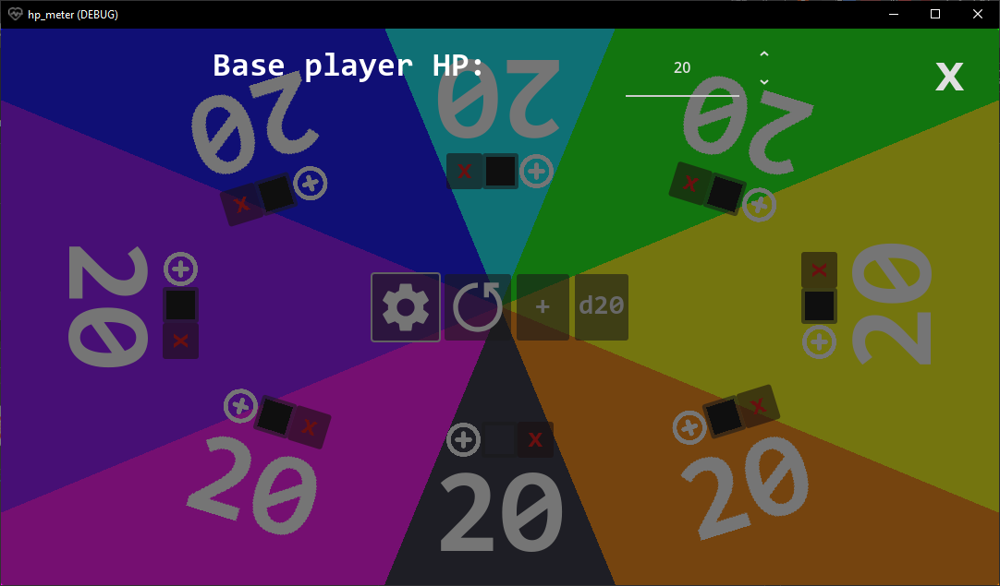

# hp_meter

A free and open app made in godot 4.4 for tracking player health in board games





## Usage

- Press "+" to add player
- Press on the right and the left of players health to change it
- Press red "x" above player to delete player
- Press color rectacle button above player to change player color
- Press "Plus" button above player to add picture for player
- Press "Cog" button to open settings
- Press d20 button to throw d20 die
- Press "Reset" button to reset player hp to default: 20 (Can be changed in settings)

## Get involved

- Make a fork (Too lazy to curate a repo)
- Copy the project
```cmd
git clone https://github.com/q3vub1h/hp_meter.git
```
- Start developing!

## Plans

- Add a die selection in settings
- Save system to save hp of players for multiple sessions

## Installation

- Install the project from Releases

## License
hp_meter is licensed under MIT and is Copyright (c)
